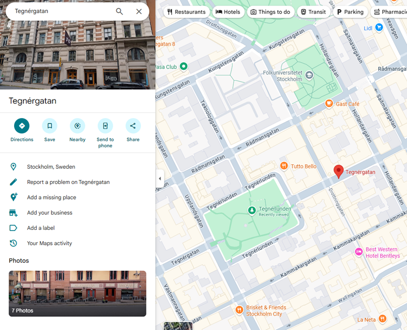

### Challenge:
This picture was taken in a park. Find the name of the park.

The flag is the park’s name it appears on Google Maps. For example, if you think the flag is in Central Park, submit uiuctf{Central Park}.

This OSINT challenge is a GEOSINT challenge, so I downloaded the picture and use google image search to find the possible matches.

It seems like the park is located in Tegnergatan, Stockholm, Sweden. To verify, I clicked the google maps to show the location and eventually get the park name.

The nearest park is named Tegnerlunden.
Flag: uiuctf{Tegnérlunden}
